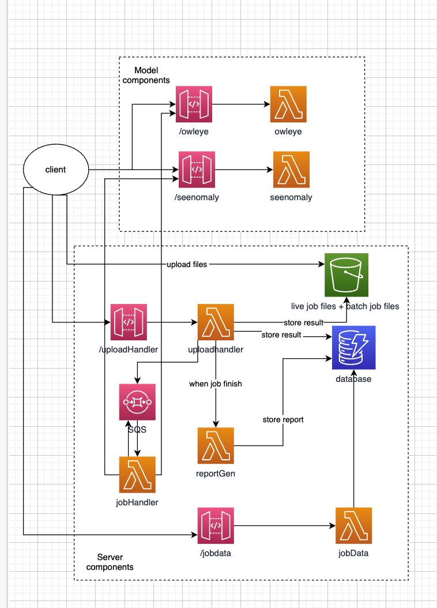
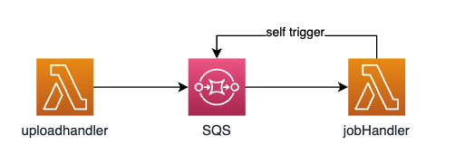

# Vision Backend <!-- omit in toc -->

## Table of Contents <!-- omit in toc -->

- [1. Tech Stack](#1-tech-stack)
- [2. Architecture](#2-architecture)
  - [2.1. Model Components](#21-model-components)
  - [2.2. Server Components](#22-server-components)
  - [2.3. Diagram](#23-diagram)
- [3. Dev Environment Set Up](#3-dev-environment-set-up)
  - [3.1. Step 1: Install tools](#31-step-1-install-tools)
    - [3.1.1. For Windows and Linux Users](#311-for-windows-and-linux-users)
    - [3.1.2. For Mac Users](#312-for-mac-users)
  - [3.2. Step 2: Install Dependencies](#32-step-2-install-dependencies)
  - [3.3. Step 3. Deploy on Your Own AWS Account](#33-step-3-deploy-on-your-own-aws-account)
    - [3.3.1. Deploy Model Vomponents](#331-deploy-model-vomponents)
    - [3.3.2. Deploy Server Components](#332-deploy-server-components)
- [4. CI/CD](#4-cicd)
  - [4.1. Pull Requests](#41-pull-requests)
  - [4.2. Continuous Deployment](#42-continuous-deployment)
- [5. Want to Contribute?](#5-want-to-contribute)
- [6. Versioning Strategy](#6-versioning-strategy)
  - [6.1. Major Change](#61-major-change)
  - [6.2. Minor Change](#62-minor-change)
  - [6.3. Patch](#63-patch)
- [7. Lambdas](#7-lambdas)
  - [7.1. UploadHandler](#71-uploadhandler)
    - [7.1.1. Job Submission Workflow](#711-job-submission-workflow)
    - [7.1.2. Email Verification Feature](#712-email-verification-feature)
    - [7.1.3. Access Files with UploadHandler](#713-access-files-with-uploadhandler)
  - [7.2. JobHandler](#72-jobhandler)
  - [7.3. ReportGen](#73-reportgen)
  - [7.4. JobData](#74-jobdata)
  - [7.5. OwlEyes](#75-owleyes)
  - [7.6. Seenomaly](#76-seenomaly)
- [8. Database Schema](#8-database-schema)
- [9. S3 bucket structure](#9-s3-bucket-structure)

<br/>

# 1. Tech Stack <!-- no toc -->

The backend uses two languages: Python and TypeScript.

- Python: Used in our machine learning models and some Lambda functions.
- Typescript: Majority of Lambdas are written in TypeScript.

The backend is hosted via AWS.

- Lambdas handles all the backend logic as well as hosting the machine learning models with container support. API Gateways create accessing endpoints. SQS acts as glues for Lambdas to trigger each other.
- Elastic Container Register is used to store the machine learning code, model and dependencies.
- S3 Bucket stores the user uploaded files and result files.
- DynamoDB stores the uploading information.

# 2. Architecture

All backend code is hosted on AWS Lambdas. The Lambdas can be categorised into two parts:

- Model Components - The machine learning models, OwlEyes and Seenomaly, located in `/model`.
- Server Components - All other logics for handling batch job, including saving and retrieving `job` information, processing a `job` etc. Located in `/server`.

These two parts are deployed separately. This is because deploying models is much slower than deploying other Lambdas. Therefore, to speed up the deployment of `server components`, we created a new deployment pipeline for `model components` since they get changed less frequently.

## 2.1. Model Components

`OwlEyes` and `Seenomaly` are packed in to two Lambdas. Each of them is triggered by API gateways which allows access from the frontend (for live jobs) and other server components (for batch jobs).

## 2.2. Server Components

Then end to end processing for a batch job is supported by the following Lambdas. Each of them has a dedicated folder. Here, just we give a high-level description for each of them. More detailed description can be found at the bottom.

- UploadHandler - Triggered by frontend. Handles uploading files and saving `job` information to database

- JobHandler - Triggered by UploadHandler. Send images and videos to `OwlEyes` and `Seenomaly` via their API endpoints and save the results to the DynamoDB and S3 Bucket. This Lambda is self-triggered to prevent having jobs unfinished due to Lambda time out.

- ReportGenerator (ReportGen) - Triggered by JobHandler. Gathers all information for a completed batch `job` to create the report in JSON format. Also, generates the access link and send it to the job uploader via email.

- JobData - Triggered by frontend. Retrieve files from the S3 Bucket and send to frontend.

## 2.3. Diagram

The diagram below shows the model and server components.


<br/>
<br/>

# 3. Dev Environment Set Up

## 3.1. Step 1: Install tools

<br />

- [ ] Install [aws-cli](https://aws.amazon.com/cli/) and [aws-sam-cli](https://docs.aws.amazon.com/serverless-application-model/latest/developerguide/serverless-sam-cli-command-reference.html).
      Here are the official docs to install [aws-cli](https://docs.aws.amazon.com/cli/latest/userguide/cli-chap-install.html) and [aws-sam-cli](https://docs.aws.amazon.com/serverless-application-model/latest/developerguide/serverless-sam-cli-install.html).
      <br/>

### 3.1.1. For Windows and Linux Users

Follow the official documentation linked above.

### 3.1.2. For Mac Users

```
/bin/bash -c "$(curl -fsSL https://raw.githubusercontent.com/Homebrew/install/HEAD/install.sh)" # install homebrew if you don't have it already

brew tap aws/tap

brew install awscli aws-sam-cli
```

- [ ] Download docker [here](https://docs.docker.com/get-docker/).

- [ ] Install [nvm](https://github.com/nvm-sh/nvm). And use nvm to install npm and node via nvm

```
curl -o- https://raw.githubusercontent.com/nvm-sh/nvm/v0.39.0/install.sh | bash

export NVM_DIR="$([ -z "${XDG_CONFIG_HOME-}" ] && printf %s "${HOME}/.nvm" || printf %s "${XDG_CONFIG_HOME}/nvm")"
[ -s "$NVM_DIR/nvm.sh" ] && \. "$NVM_DIR/nvm.sh" # This loads nvm
```

```
nvm node
nvm npm
```

## 3.2. Step 2: Install Dependencies

<br />

- [ ] Install typescript globally

```
npm install -g typescript
```

- [ ] Install packages
      Do the following inside each folder of `./server/*`

```
npm install
```

## 3.3. Step 3. Deploy on Your Own AWS Account

### 3.3.1. Deploy Model Vomponents

Create a ECR repository. Save the URI which is outputted to the terminal. The URI will be used when deploying. This is only needed for the first deployment.

```
aws ecr create-repository --repository-name REPO_NAME --image-scanning-configuration scanOnPush=true
```

Then build and deploy

```
cd ./models
sam build
sam deploy --guided #only need guided for first deployment
```

### 3.3.2. Deploy Server Components

```
cd ./server
sam build
sam deploy --parameter-overrides emailPassword=EMAIL_PASSWORD --guided #only need guided for first deployment
```

EMAIL_PASSWORD is the password of the email account which used to send email.

<br/>

# 4. CI/CD

## 4.1. Pull Requests

Pull request checks are made to ensure the code quality and correctness. This includes linting, and pre-build and validation via aws-sam.

## 4.2. Continuous Deployment

The actual hosting is currently on one of our member's AWS account. Building and deployment have been automated to their account upon merging to the `develop` branch for `server components`. Changes on `model components` require manual deployment by running the above SAM commands by the account owner.

# 5. Want to Contribute?

You can report a bug or suggest a feature by creating an issue in the GitHub repository. If you'd like to contribute code to the codebase, please read the [project guidelines](https://github.com/Visual-Testing-for-Android-Apps/Project-guidelines) before you get started. Then fork and clone the project repository create a branch within your forked repository with a descriptive name of your contribution e.g. _db_filename_string_bugix_. Work within this branch of your change and whenever you are ready to merge your branch, create a pull request from your head repository to the base repository. Members of the Vision team will review your pull request, and either send feedback on your changes or succesfully merge them!

# 6. Versioning Strategy

Moving forward, this repository will use a versioning strategy via a Major.Minor.Patch format. A Git Tag of the new version **must** be included with each merge into the `develop` and `master` branch following a pull request. The merge of this iteration of the README will initiate V1.0.0.

## 6.1. Major Change

A major change is one that is defined as causing a breaking change to the backend and will not be backwards compatible with previous major versions. For example, someone working with V4 deployment cannot assume that they may be able to use all of the features of the V1, V2 or V3 deployments. This generally happens via removing functionality or changing funamental core concepts on how the code should work, disrupting the usual processes. **All major changes must be compatible with frontend integration.** The major version number should be incremented by 1 and the minor and patch version numbers should be reset to 0 with the merge following the pull request of the major change.

#### 7.1.0.1. **Example** <!-- omit in toc -->

Complete overhaul of the DynamoDB schema<br/>
V4.13.4 -> V5.0.0

## 6.2. Minor Change

A minor change is one that is defined as non-breaking change to the backend that is compatible with all previous versions of the same major version. For example, someone working with V4.13 deployment can assume that they may be able to use all features of previous V4 deployments. This generally happens by adding functionality or changing code for efficiency or effectiveness, not disrupting the usual processes. The minor version number should be incremented by 1 and the patch version number should be reset to 0 with the merge following the pull request of the minor change.

#### 7.2.0.1. **Example** <!-- omit in toc -->

Added automatic video splitting functionality<br/>
V4.13.4 -> V4.14.0

## 6.3. Patch

A patch is one that is defined as a bug fix that is compatible with all previous versions of the same major version. For example, someone working with V4.13.2 deployment can assume that they may be able to use all features of previous V4 deployments. The patch version number should be incremented by 1 following the pull request of the patch.

#### 7.3.0.1. **Example** <!-- omit in toc -->

Fixed random character in string bug<br/>
V4.13.4 -> V4.13.5

# 7. Lambdas

## 7.1. UploadHandler

Root URL: https://2fr7fj3ota.execute-api.ap-southeast-2.amazonaws.com/Prod/

### 7.1.1. Job Submission Workflow

Front submit `job` via UploadHandler. There are `three steps` for job submission.

🔵 1. Send a POST request to get presigned URLs for upload image/video
example request body <br/>

`POST /job/upload-request`

```
// Sample request body
{
    "email": "sample_email@gmail.com",
    "fileNames”: ["test.mp4", "test.jpg"]
}
// Sample response body
{
    "uploadUrls":
                {
                    "test.mp4”: "preSigned-url1",
                    "test.jpg”: "preSigned-url1"
                }
    "jobID”: "jobId"
}
```

🔵 2. For each file, send a PUT request on the presigned URL with file
<br/>

`PUT $preSigned-url-returned-from-step1`

🔵 3. After all files have been uploaded, send a POST request to notify finish
<br/>

`POST /job/upload-done`

```
// Sample request body
{
    "jobID”: “jobId"
}
// Sample response
statusCode = 200 -> start to process the job
statusCode != 200 -> error
```

### 7.1.2. Email Verification Feature

The email verification feature is implemented but not yet integrated with the front end.
Verification code expires in 500 seconds.

The module `sesService.ts` contains functionality which

- Sends Verification Code
- Verifies Code

Three API endpoints are built around the email verification feature.

Verify code:
<br/>

`POST /job/verify-code`

```
// Sample request body
{
    "verificationCode": "some 6-digit number", // can be anything code for now send
    "jobID”: “jobId returned from the first API call"
}
// Sample response body
{
    "jobID": "30ecd6ed-78ab-40d6-b3cd-79c2e3c4922e",
    "verified": true,
    "message": "verify code ..."
}
```

Update their email:
<br/>

`POST /job/update-email`

```
// Sample request body
{
    "email": "new_email_address",
    "jobID”: “jobId returned from the first API call"
}
```

Resend verification code:
<br/>

`POST /job/update-email`

```
// Sample request body
{
    "jobID”: “jobID"
}
```

### 7.1.3. Access Files with UploadHandler

Get one file via file reference
<br/>

`Post /job/file`

```

// sample request
{"filePath": "jobID/1231.jpg”}

// sample response
{"url”: "downloadUrl"}
```

```
GET downloadUrl
```

OR get all job file at once
<br/>

`Post /job/files`

```

// sample request
{"jobID": "4141”}

// sample response
{
    "4141/342.jpg":"download_url1",
    "4141/result/342.jpg":"download_url1",
    "4141/342.mp4":"download_url3",
}
```

```
GET downloadUrl
```

## 7.2. JobHandler

Sample event:

```
{'jobKey': 'the job id in the database'}
```

The JobHandler lambda receives a `jobKey` from the event. It is responsible for processing all unprocessed images or videos in the `job` via calling the OwlEyes and Seenomaly Lambdas. It has a timeout of 800 seconds. It triggers itself before the time out when the `job` is not yet finished. This is illustrated in the figure below.



## 7.3. ReportGen

<span style="color: red">TODO</span>.

## 7.4. JobData

The user receives an email containing a link such as
https://afternoon-woodland-24079.herokuapp.com/batchreportpage/publicKey?pwd=password

The frontend uses the publicKey and password from the link to send a POST request for
the presigned URL for the batch job. An example request body is given below.

```
POST /jobdata/

// Sample request body
{
    "publicKey": "publicKeyExample",
    "pwd": "passwordExample"
}

// Sample response body
{
    "url":  "presignedUrlExample",
}
```

This presigned URL gives the frontend access to a folder containing a file named report.json. This file contains the batch job results with the following format.

```
{
    "images": [
        {
            "titles": ["List of image UI issue titles"],
            "descs": ["List of image UI issue descriptions"],
            "orig_image": "pathToOriginalImage",
            "heatmap_image": "pathToHeatmapImage"
        }
    ],
    "videos": [
        {
            "title": "Video UI issue title",
            "desc": "Video UI issue description",
            "classification": "Video UI issue code",
            "video": "pathToVideo"
        }
    ]
}
```

## 7.5. OwlEyes

Image Endpoint:
<br/>

`POST` https://u8iacl4gj0.execute-api.ap-southeast-2.amazonaws.com/Prod/owleye

Request body contains

- the `raw binary` of the image, or
- a `download_url` inside a json object

```
// Sample json request body
{"download_url”: “url to download the image"}
```

```
// Sample return body
    {

        "original_img”: original_img , // this is the original image
        'res_img': res_image, // The base 64 encoded result image
        'bug_type': 'Null value ‘|’Missing image ‘|’Component occlusion'
    }
```

## 7.6. Seenomaly

Video Endpoint:
<br/>

`POST` https://u8iacl4gj0.execute-api.ap-southeast-2.amazonaws.com/Prod/Seenomaly

Request body contains

- the `raw binary` of the video, or
- a `download_url` inside a json object

```
// Sample json request body
{"download_url”: “url to download the video"}
```

```
// Sample return body
    {
        "classification": error code,
        "explanation": error description
    }
```

Explanation contains one of

```
[
        "Unknown",
        "Pass through other material",
        "Lack of scrimmed background",
        "Snackbar blocks bottom app bar",
        "Stack multiple banners",
        "Flip card to reveal information",
        "Move one card behind other card",
        "Stack multiple snackbars",
        "Lack of shadow",
        "Invisible scrim of modal bottom sheet",
]
```

# 8. Database Schema

```
{
 "id": String,
 "emailVerified": Boolean,
 "emailVerification": {
  "createdAt": String eg."2021-09-20T08:27:18.972Z",
  "code": String eg."910695"
 },
 "files": [
  {
   "contentType": String "video/mp4"|"image/jpeg “|”image/png",
   "orginalName": String e.g. "test_1.mp4",
   "s3Key": String
   "status": String "NEW"|"DONE",
   "type": String "VIDEO"|"VIDEO"
    "result": {
    "message": String|String[] e.g.."Snackbar blocks bottom app bar",
    "code": String? eg."3"
    "outputKey": String?
   },
  },
 ],
 "createdAt": String eg."2021-09-20T08:25:40.984Z",
 "email": String e.g.."Example@gmail.com"
 "jobStatus": String? "PROCESSING"|"GENERATING"|"DONE",
}

```

- waiting for the file to be processed. -> In DynamoDB, jobStatus = PROCESSING, file.status = NEW
- all file completed. -> In DynamoDB, jobStatus = GENERATING, file.status = DONE

# 9. S3 bucket structure

For a single jobs,

|-jobID <br>
&nbsp;&nbsp;&nbsp;&nbsp; |-file1.mp4 <br>
&nbsp;&nbsp;&nbsp;&nbsp; |-file2.png <br>
&nbsp;&nbsp;&nbsp;&nbsp; |-result <br>
&nbsp;&nbsp;&nbsp;&nbsp;&nbsp;&nbsp;&nbsp;&nbsp;&nbsp;&nbsp;&nbsp;&nbsp;|-result_file2.jpg <br>
&nbsp;&nbsp;&nbsp;&nbsp;|-report.html <br>
