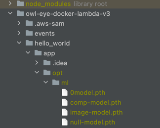
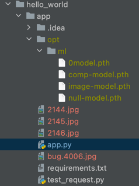

# Owl Eye API (multiple models version)

## Declaimer

Base on Rebecca Chen's code

## Author 
Yinghao Ma

Let me know if you have any question or find any bug


# ****It has not been deployed on AWS


## Access example 

### Approach 1 : Postman 
1. Select the `binary` option. 
2. upload the image file 


### Approach 2: Python 
1. Encoding the image 
```python 
with open(IMAGE_NAME, 'rb') as open_file:
    byte_content = open_file.read()
base64_bytes = base64.b64encode(byte_content)
base64_string = base64_bytes.decode('utf-8')
raw_data = base64_string
```
2. send the image to the API 
```python 
url= 'https://8uxam9kkod.execute-api.ap-southeast-2.amazonaws.com/Prod/owleye/'
res = requests.post(url, data=raw_data, timeout=5000)
```

3. process the result 
```python 
print(res.status_code)
print(res.json())
if res.status_code == 200:
    img = res.json()["res_img"]
    # decode img
    image = Image.open(BytesIO(base64.b64decode(img.encode('utf-8'))))

    image.save(OUTPUT_IMAGE_NAME)
```

## Future improvement 

May wait the text-overlap model.

## Others 


# Instruction on setting up API 


## Important files 
**owl-eye-docker-lambda-v3/hello_world/app**

This folder contains all the files we need for the model to run. 
* app.py. -  When the lambda function is invoked by an API, it will call the function `handler(event, context)` in this script. 
In the API call,  `event` is what the front-end sent to us. The return of this function will be sent to the frontend as the API response. 

* requirements.txt - this will be read by the Dockerfile

* the model - not been uploaded to repo because it is too big. 


## What to do with the code 
1. Read the input image/video through the `event` argument in the `handler` function. Instead of open local image/video files. 
2. create python venv, install packages to the venv. After all dependencies are installed and the code is working in the venv. 
Use `pip freeze  > requirements.txt` to create the requirements.txt file. 
This makes sure we only install packages that is relevent to the script.  

create the python venv folder
```bash
python3 -m venv <NEW_FODLER_NAME>
```
Activate the venv 
```bash
source <NEW_FODLER_NAME>/bin/activate
```
Install packages. (for example requests)
```bash
pip install requests 
```
create the requirements.txt
```bash
pip freeze > requirements.txt
```
Exit the venv
```bash
deactivate 
```

## Local testing 


First you need to set the `opt/ml`directory under the `app` directory
and move the model into the `ml` directory



You can drag image you want to test to the `app` directory




You can uncomment the ```pythonif __name__ == "__main__" ```part

and change the `THE_IMAGE_YOU_WANT_TO_TEST` to the image name you want to test


```python

if __name__ == '__main__':
    with open(THE_IMAGE_YOU_WANT_TO_TEST, 'rb') as open_file:
        byte_content = open_file.read()
    base64_bytes = base64.b64encode(byte_content)
    base64_string = base64_bytes.decode('utf-8')
    raw_data = base64_string

    MY_FILE_STRING = raw_data

    event = {'body' :  MY_FILE_STRING}

    print(handler(event,0))

```

The return json with `statusCode == 200` should contain four part
`predicted_label`,
`original_img`,
`res_img`,
`bug_type`
