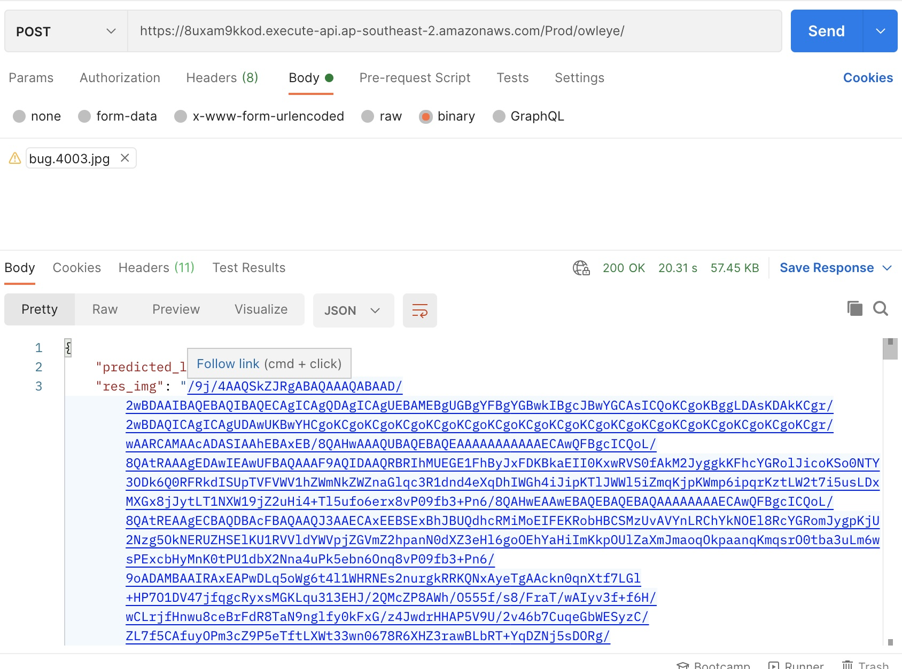

# Owl Eye API 
## Author 
Rebecca Chen

Let me know if you have any question or find any bug

## End Point 
POST https://8uxam9kkod.execute-api.ap-southeast-2.amazonaws.com/Prod/owleye/

## Access example 

### Approach 1 : Postman 
1. Select the `binary` option. 
2. upload the image file 



### Approach 2: Python 
1. Encoding the image 
```python 
with open(IMAGE_NAME, 'rb') as open_file:
    byte_content = open_file.read()
base64_bytes = base64.b64encode(byte_content)
base64_string = base64_bytes.decode('utf-8')
raw_data = base64_string
```
2. send the image to the API 
```python 
url= 'https://8uxam9kkod.execute-api.ap-southeast-2.amazonaws.com/Prod/owleye/'
res = requests.post(url, data=raw_data, timeout=5000)
```

3. process the result 
```python 
print(res.status_code)
print(res.json())
if res.status_code == 200:
    img = res.json()["res_img"]
    # decode img
    image = Image.open(BytesIO(base64.b64decode(img.encode('utf-8'))))

    image.save(OUTPUT_IMAGE_NAME)
```

## Future improvement 
Instead of return back the heatmap directly, we need to store it to the S3 bucket. 